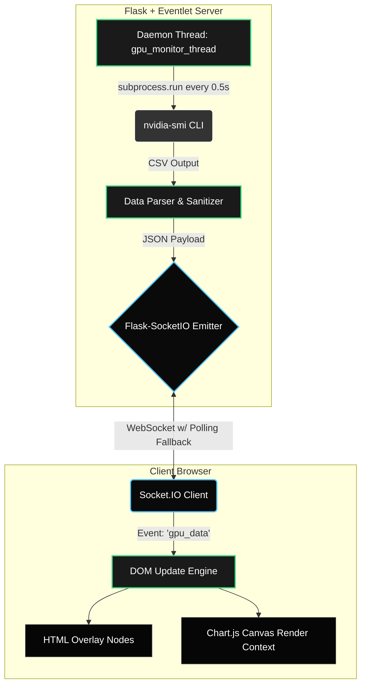

<div align="center">
  # ⚡ NVIDIA-GPU-PowerMonitor

  **Real-time, Low-Latency NVIDIA GPU Telemetry Dashboard**

  [](https://opensource.org/licenses/MIT)
  [](https://www.python.org/)
  [](https://flask.palletsprojects.com/)
  [](https://socket.io/)

  *A high-performance web dashboard providing sub-second resolution telemetry for NVIDIA GPUs, streaming power draw, thermal performance, and VRAM utilization over WebSockets.*
</div>

---

## 🚀 Technical Overview

NVIDIA-GPU-PowerMonitor is engineered to provide granular, real-time observability into GPU hardware metrics. Unlike standard task managers that poll at 1Hz or slower, this architecture leverages an asynchronous Python backend to query hardware registries via `nvidia-smi` and push diffs to a frontend client via WebSockets at high frequencies.

### Key Capabilities
- **Sub-second Polling**: Configured for 500ms hardware polling intervals, minimizing latency between hardware spikes and visualization.
- **Asynchronous I/O**: Utilizes `eventlet` with Flask-SocketIO to prevent blocking the main thread during hardware querying operations.
- **Zero-Dependency Frontend**: The UI relies solely on vanilla JavaScript (ES6+), HTML5, and CSS3, pulling in `Chart.js` and `Socket.IO` via CDN to maintain a lightweight footprint.
- **Resilient Fallbacks (Mocking)**: Includes an integrated stochastic data generator for UI development on host machines lacking NVIDIA drivers.

## 🏗️ System Architecture



### Hardware Query Specifics
The backend interfaces with the NVIDIA System Management Interface (`nvidia-smi`) using the following optimized query to minimize overhead:

```bash
nvidia-smi --query-gpu=power.draw,enforced.power.limit,power.max_limit,memory.used,memory.total,name,temperature.gpu,utilization.gpu --format=csv,noheader,nounits
```
*Note: The script dynamically handles `[N/A]` or unsupported queries (common in laptop SKUs for `power.limit`) by safely falling back to absolute TGP (`power.max_limit`).*

## 🔌 WebSocket API Reference

The backend communicates strictly via Socket.IO events.

### Outbound Events (Server -> Client)

#### `gpu_data`
Emitted every 500ms containing an array of GPU objects.
```json
[
  {
    "power_draw": 45.2,
    "power_limit": 105.0,
    "power_max_limit": 105.0,
    "vram_used": 1417.0,
    "vram_total": 6141.0,
    "gpu_name": "NVIDIA GeForce RTX 4050 Laptop GPU",
    "temperature": 41,
    "gpu_utilization": 20
  }
]
```

#### `gpu_error`
Emitted if the `nvidia-smi` binary throws an exception, times out, or becomes unresponsive.
```json
{
  "message": "Unable to read GPU data."
}
```

## 📋 System Requirements

* **OS**: Windows 10/11, Ubuntu 20.04+, or macOS (Mock mode only).
* **Python**: `v3.8+`
* **GPU**: Any NVIDIA GPU with Fermi architecture or newer.
* **Drivers**: Minimum NVIDIA Display Driver version compatible with your OS (WDDM for Windows, proprietary Linux drivers). `nvidia-smi` must be accessible globally in the system `$PATH`.

## 🛠️ Installation & Setup

1. **Clone the repository**:
   ```bash
   git clone https://github.com/yourusername/NVIDIA-GPU-PowerMonitor.git
   cd NVIDIA-GPU-PowerMonitor
   ```

2. **Initialize a Virtual Environment** *(Highly Recommended)*:
   ```bash
   python -m venv venv
   # Windows
   venv\Scripts\activate
   # Linux/macOS
   source venv/bin/activate
   ```

3. **Install Dependencies**:
   ```bash
   pip install -r requirements.txt
   ```
   *Dependencies include `flask`, `flask-socketio`, and `eventlet` for asynchronous non-blocking I/O.*

## 💻 Running the Server

Start the application daemon:

```bash
python app.py
```
> The server listens on `0.0.0.0:5000`. Navigate to [http://localhost:5000](http://localhost:5000) to access the dashboard.

### 🧪 Developer Mock Mode
To work on the frontend UI without querying physical hardware, inject the `GPU_MONITOR_MOCK` environment variable to spawn the stochastic data generation loop.

**Windows (PowerShell):**
```powershell
$env:GPU_MONITOR_MOCK="1"; python app.py
```

**Linux/macOS:**
```bash
GPU_MONITOR_MOCK=1 python app.py
```

## 🗂️ Project Hierarchy

```text
NVIDIA-GPU-PowerMonitor/
├── app.py                  # Entrypoint: Flask server, SocketIO routes, and hardware polling loop
├── requirements.txt        # PIP dependency manifest
├── LICENSE                 # MIT License (c) 2026 Aditya Guha
├── README.md               # Technical documentation
├── static/
│   ├── css/
│   │   └── style.css       # Pitch-black CSS variables, Flexbox/Grid layouts
│   ├── img/
│   │   └── logo.svg        # Scalable ADI Vector Logo
│   └── js/
│       └── app.js          # Socket.IO client runtime and Chart.js state management
└── templates/
    └── index.html          # HTML5 Dashboard layout and DOM anchors
```

## 📄 License

This project is licensed under the MIT License. Copyright (c) 2026 Aditya Guha. See the [LICENSE](LICENSE) file for full details.
